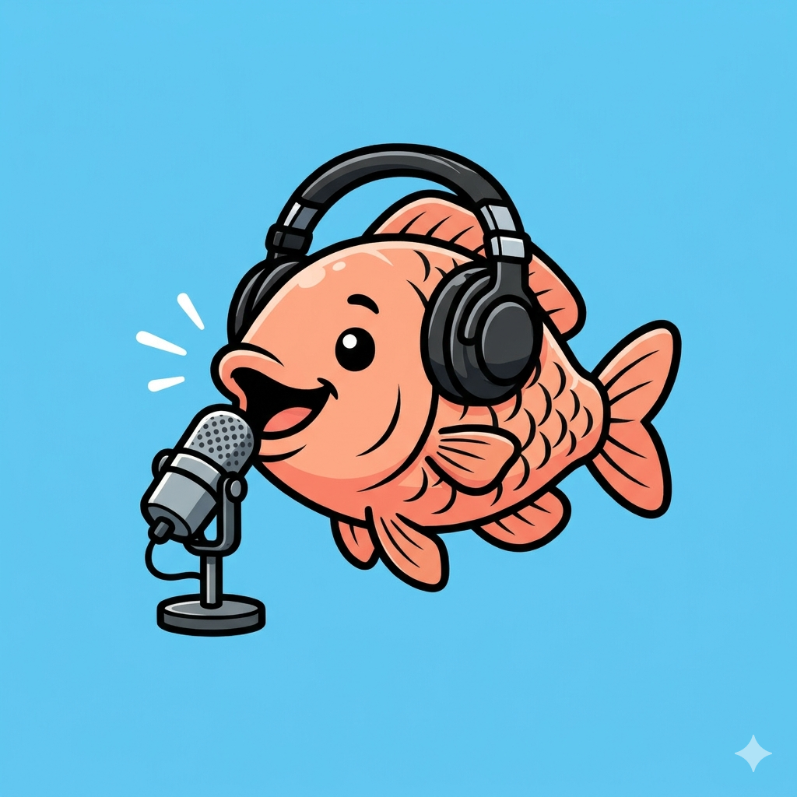

# Tilapia for Jellyfin



Tilapia brings each listener's podcast subscriptions into Jellyfin. Search for public shows or add an RSS/Atom feed in the responsive Tilapia manager, then browse and play it from **Channels → Podcasts** in compatible Jellyfin clients.

Tilapia is an independent community plugin and is not currently an official Jellyfin project.

## Features

- Subscriptions belong to the authenticated Jellyfin user.
- Search public podcasts by name, publisher or topic and subscribe with one click.
- Import and export public subscriptions using OPML.
- See when each feed was last checked and whether it needs attention.
- Public feed metadata and caches are deduplicated by feed or enclosure URL.
- Episodes default to newest first and the latest 10.
- Users can expose 10, 50, 100, 200, 500 or all public episodes.
- Public episodes can stream directly or cache when played.
- Feed artwork is shown in the channel where clients support it.
- Ordinary users manage feeds at `https://YOUR-SERVER/Tilapia`; Dashboard access is not required.
- Private/member RSS is experimental, locally cached and provider-dependent. Patreon private RSS is currently unsupported.
- No Jellyfin database or existing media library is modified.

## Compatibility

| Component | Status |
| --- | --- |
| Tilapia 1.1 | Jellyfin Server 12.0; .NET 10 |
| Tilapia 1.0 | Jellyfin Server 10.11.5 - 10.11.11; .NET 9 |
| Jellyfin Web | Supported |
| Jellyfin Android and Windows clients | Channel playback tested |
| Third-party music-only clients such as Finamp | Not supported |

Jellyfin plugin ABI compatibility is strict. A release is only advertised for server versions against which it has been built and tested.

## Install from the plugin catalogue

After the first catalogue release is published:

1. Open **Dashboard → Plugins → Repositories**.
2. Add a repository named `Tilapia` with this URL:

   `https://raw.githubusercontent.com/sevquis-collab/jellyfin-plugin-tilapia/main/manifest.json`

3. Open **Catalog**, select **Tilapia**, install it, and restart Jellyfin.
4. For each listener, open **Dashboard → Users → Access → Channels** and allow **Podcasts**.
5. Give listeners the address `https://YOUR-SERVER/Tilapia`.

If Jellyfin has a Base URL, retain it, for example `https://example.com/jellyfin/Tilapia`.

## Manual installation

1. Stop Jellyfin.
2. Create a single `Podcasts_1.1.0.0` folder below Jellyfin's plugins directory and extract the release ZIP into it. The DLL and `meta.json` should sit directly inside that folder.
3. Ensure only one Tilapia/Podcasts version folder remains in the plugins directory.
4. Start Jellyfin and confirm that **Podcasts** appears under installed plugins.

On upgrades, keep the existing isolated data directory. Subscriptions and cached episodes survive plugin replacement.

## Using Tilapia

Open `/Tilapia` on the same Jellyfin server and sign in with Quick Connect or your Jellyfin username and password. Search terms are sent to Apple's public podcast directory through the Jellyfin server. Passwords are sent to Jellyfin's standard authentication endpoint and are never stored by Tilapia.

OPML export includes public RSS addresses only. Private/member feed addresses are deliberately excluded because those URLs commonly contain access credentials.

Public feeds are the supported path. Private feed URLs act as credentials. Tilapia protects them at rest, masks them in API responses, avoids logging them, and only exposes completely downloaded local media to Jellyfin. Some providers block server-hosted clients, so compatibility is not guaranteed.

## Data and removal

Tilapia stores its own state below Jellyfin's data directory in `podcasts-v01`. It does not write to Jellyfin libraries or directly alter Jellyfin's database.

To remove Tilapia, stop Jellyfin, move the plugin folder out of the plugins directory, and start Jellyfin. Existing libraries are unaffected. The isolated `podcasts-v01` directory may be retained for reinstall recovery or deleted separately to remove Tilapia subscriptions and cached media.

See [Privacy and data handling](docs/PRIVACY.md) and [Architecture](docs/ARCHITECTURE.md) for details.

## Build and test

```powershell
dotnet restore .\Tilapia.sln
dotnet build .\Tilapia.sln -c Release --no-restore -warnaserror
dotnet test .\Tilapia.sln -c Release --no-build
snyk test --all-projects --severity-threshold=low --policy-path=.\.snyk
```

The build includes the Sonar C# analyzer and treats its findings as errors. The Snyk policy contains one documented, expiring exception for an old Jellyfin server endpoint that Tilapia does not ship or call. The plugin references `Jellyfin.Controller` and `Jellyfin.Model` as compile-only dependencies; Jellyfin host assemblies must not be distributed inside the plugin ZIP.

## Contributing and security

Bug reports and pull requests are welcome. Read [CONTRIBUTING.md](CONTRIBUTING.md) before contributing. Please report security problems privately as described in [SECURITY.md](SECURITY.md).

## Licence

Tilapia is licensed under the [GNU General Public License v3.0](LICENSE). Unless otherwise noted, the bundled Tilapia artwork is distributed under the same licence.
